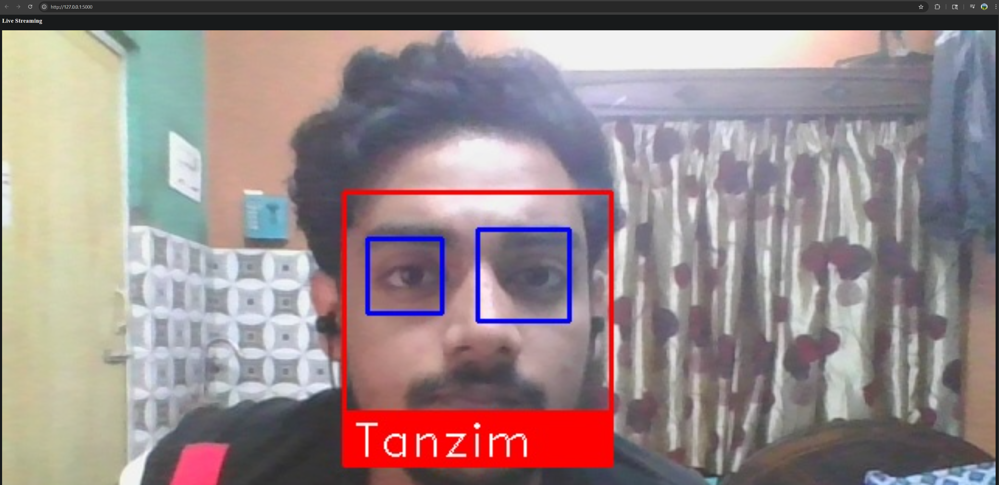

# Face Recognition Flask App

Real-time face recognition system using Flask, OpenCV, and face_recognition.

## Features
- Live webcam streaming
- Face detection and recognition
- Eye detection using Haar Cascade
- Optimized frame processing

## Tech Stack
Python, Flask, OpenCV, face_recognition, NumPy

## Run
pip install -r requirements.txt
python app.py

Open: http://127.0.0.1:5000/

## Output

